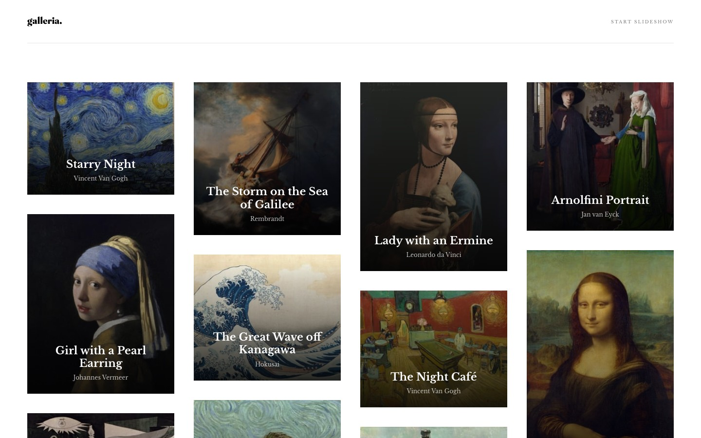
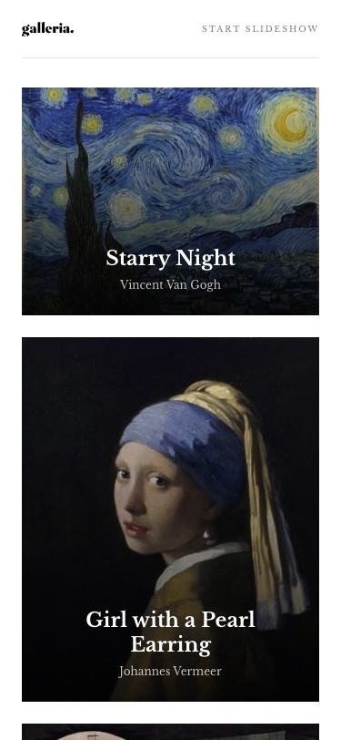

# Galleria Slideshow Site

A responsive art gallery slideshow web app that lets users browse 15 famous paintings in a masonry grid and navigate through them one by one in a full-screen detail view — with a lightbox, progress bar, and source attribution.


This is a solution to the [Galleria slideshow site](https://www.frontendmentor.io/challenges/galleria-slideshow-site-tEA4pwsa6) challenge on Frontend Mentor.

## Table of Contents

- [Screenshots](#screenshots)
- [Features](#features)
- [Built With](#built-with)
- [Getting Started](#getting-started)
- [Project Structure](#project-structure)
- [Tests](#tests)
- [What I Learned](#what-i-learned)
- [Roadmap](#roadmap)
- [Author](#author)
- [Acknowledgments](#acknowledgments)

## Screenshots

### Desktop (1440px)



### Mobile (375px)



## Features

- **Masonry grid** — 4-column (desktop) / 2-column (tablet) / 1-column (mobile) layout using CSS `column-count`
- **Slideshow navigation** — prev/next arrows cycle through all 15 paintings
- **Progress bar** — fixed footer bar fills from 0 → 100% as you navigate
- **Lightbox modal** — click "View Image" to see the full-resolution painting; close with button or Escape key
- **Responsive** — pixel-perfect across 375px, 768px, and 1440px viewports
- **Accessible** — semantic HTML, ARIA roles on dialog and progressbar, descriptive alt text

## Built With

- [React 19](https://react.dev/) — UI component model
- [TypeScript 5](https://www.typescriptlang.org/) — type-safe props and data
- [Vite 8](https://vitejs.dev/) — lightning-fast dev server and build
- [React Router v6](https://reactrouter.com/) — SPA routing (`/` and `/gallery/:id`)
- CSS Modules — scoped component styles with no class collisions
- [Vitest](https://vitest.dev/) + [Testing Library](https://testing-library.com/) — unit and integration tests

## Getting Started

### Prerequisites

- Node.js >= 18
- npm >= 9

### Installation

```bash
git clone https://github.com/gusanchefullstack/fsdev-galleria-slideshow-site.git
cd fsdev-galleria-slideshow-site
npm install
```

### Running locally

```bash
npm run dev
```

Open [http://localhost:5173](http://localhost:5173) in your browser.

### Build for production

```bash
npm run build
npm run preview
```

## Project Structure

```
src/
├── components/
│   ├── Header/          # Logo + START/STOP SLIDESHOW button
│   ├── PaintingCard/    # Masonry grid card with hover overlay
│   ├── GalleryGrid/     # CSS column-count masonry container
│   ├── DetailView/      # Hero image + info panel + description
│   ├── Lightbox/        # Full-screen modal via createPortal
│   ├── SlideFooter/     # Fixed footer: title/artist + prev/next nav
│   └── ProgressBar/     # Fixed progress indicator
├── pages/
│   ├── HomePage.tsx     # Grid view: /
│   └── GalleryPage.tsx  # Detail view: /gallery/:id
├── data/
│   ├── data.json        # Raw painting data (15 items)
│   └── paintings.ts     # Typed wrapper with path normalization
├── styles/
│   ├── variables.css    # Design tokens: colors, fonts, spacing
│   └── global.css       # CSS reset + base typography
├── test/                # Vitest unit tests for each component
└── types/index.ts       # Painting TypeScript interfaces
```

## Tests

This project uses [Vitest](https://vitest.dev/) with jsdom and React Testing Library.

```bash
npm test            # Run all 20 tests once
npm run test:watch  # Watch mode for development
```

Test coverage:
- `PaintingCard` — renders title/artist, fires onClick with correct index, accessible aria-label
- `GalleryGrid` — renders all 15 cards, correct index passed on click
- `SlideFooter` — prev/next callbacks fire, buttons disabled at boundaries
- `ProgressBar` — correct fill widths at first/middle/last slide, ARIA attributes
- `Lightbox` — close button and Escape key both invoke onClose, dialog role/aria-modal

## What I Learned

### CSS column-count masonry

Native CSS masonry via `column-count` requires `break-inside: avoid` on child elements so cards never split across columns. No JavaScript or external library needed.

```css
.grid {
  columns: 4;
  column-gap: 20px;
}
.grid > * {
  break-inside: avoid;
  margin-bottom: 20px;
}
```

### React Router + Vite public assets

Data paths in `data.json` use `./assets/...` which resolves relative to the *URL path*, not the domain root. At `/gallery/0` the browser looks for `/gallery/assets/...` — a 404. Fixed with a path normalizer in `paintings.ts`:

```ts
function fixPath(path: string) {
  return path.startsWith('./') ? path.slice(1) : path
}
```

### createPortal for accessible modals

Using `ReactDOM.createPortal` renders the lightbox as a direct child of `<body>`, ensuring it sits above all page content in the stacking context without relying on z-index gymnastics.

### CSS Grid for pixel-perfect Figma layouts

The detail view uses a two-column grid (`848px 1fr`) where the left column uses `position: relative` with absolutely-positioned child elements to achieve the Figma-specified overlap between the hero image and the info panel.

### Responsive breakpoints

| Breakpoint | Layout |
|---|---|
| ≤ 600px | 1-column grid, stacked detail view |
| ≤ 768px | 2-column grid |
| ≤ 1024px | 3-column grid |
| ≤ 1100px | Tablet detail view with full-width image |
| > 1100px | 4-column grid, full side-by-side detail view |

## Roadmap

- [x] 4-column masonry grid
- [x] Slideshow navigation (prev/next)
- [x] Progress bar
- [x] Lightbox modal
- [x] Responsive (mobile / tablet / desktop)
- [x] Vitest unit tests
- [ ] Keyboard-only navigation through slideshow
- [ ] Smooth slide transition animation
- [ ] Autoplay mode with configurable interval

## Author

[](https://www.frontendmentor.io/profile/gusanchefullstack)
[](https://www.linkedin.com/in/gustavosanchezgalarza/)
[](https://github.com/gusanchefullstack)
[](https://hashnode.com/@gusanchedev)
[](https://x.com/gusanchedev)
[](https://bsky.app/profile/gusanchedev.bsky.social)
[](https://www.freecodecamp.org/gusanchedev)

## Acknowledgments

- [Frontend Mentor](https://www.frontendmentor.io) — challenge design and assets
- [Google Fonts — Libre Baskerville](https://fonts.google.com/specimen/Libre+Baskerville) — serif typeface used throughout
- [React Testing Library](https://testing-library.com/docs/react-testing-library/intro/) — testing utilities

## License

Distributed under the MIT License.
